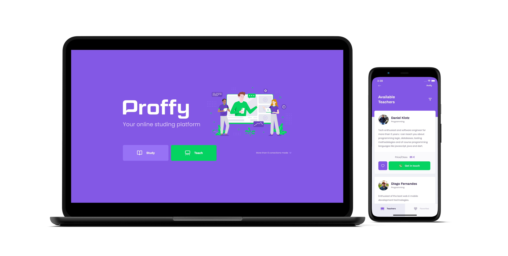

# Proffy - 👨🏻‍🏫 Proffy - A new way to learn anything you need with teachers! Choose your teacher by subject and price. 📚  

### This is a ReactJs/ React Native/ NodeJs project made for fun.

### :collision: Tech Stack

- ReactJs
- React Native
- NodeJs
- Knex

### :electric_plug: Requeriments

- Node.JS >= 12.16.2
- Yarn >= 1.22.4
- Expo >=3.23.3

### :computer: Getting started with the backend

- cd ./server
- yarn i
- yarn knex:migrate
- yarn start

:heavy_exclamation_mark: The backend services will start on port 3333

### :computer: Getting started with the web application

- cd ./web
- yarn i
- yarn start

:heavy_exclamation_mark: The web application will start on port 3000

### :iphone: Getting started with the mobile project

- cd ./mobile
- yarn i
- yarn start

:heavy_exclamation_mark: The mobile application will open an Expo interface, from there you can chose to run the app in an emulator or a real device.

### <a href="http://linkedin.com/in/danielfelipeklotz">Contact me on LinkedIn</a>
